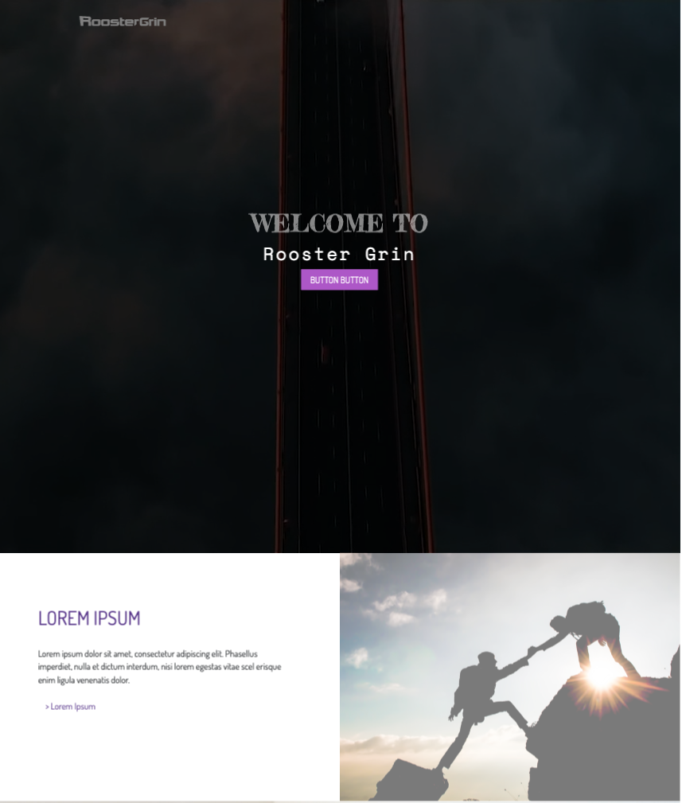
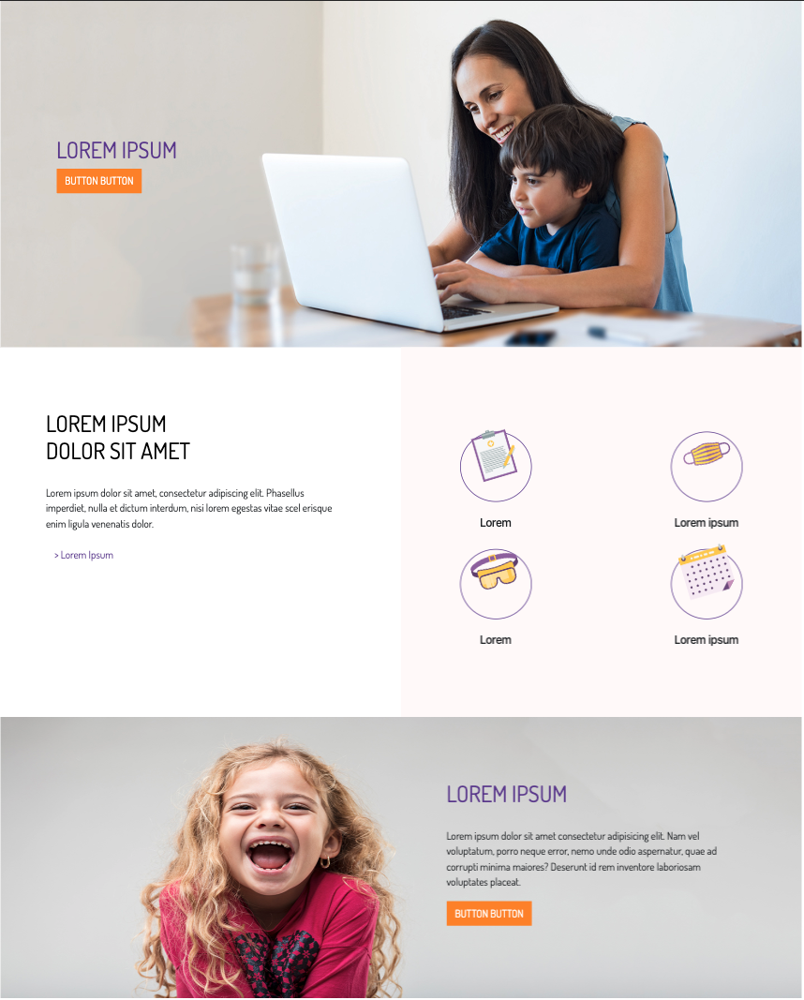
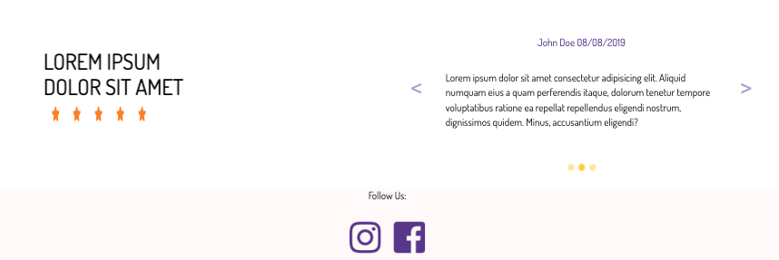

# Front-End-Rooster-Grin---JS

## Description
------

The goal of this project is to create a client website that has some key features requested by the client (i.e. Rooster Grin as the client).

## Screenshot
------

## Technology
------

- HTML
- CSS
- JavaScript
- JQuery

###### Framework
- Bootstrap

###### Third Party
- Google Font
- Font Awesome

###### Deployment:
- Heroku

Here is the [Link](https://stark-shore-03051.herokuapp.com/)